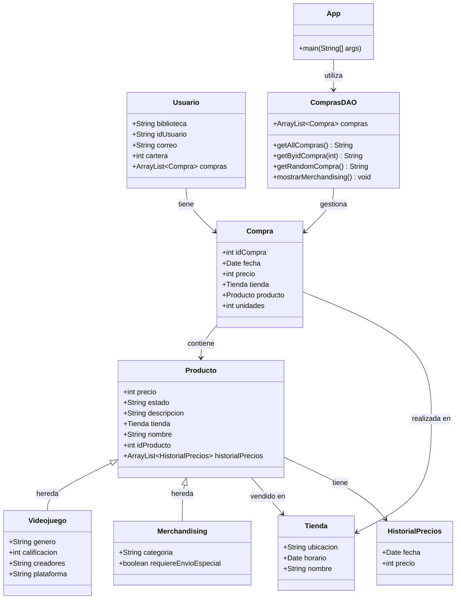
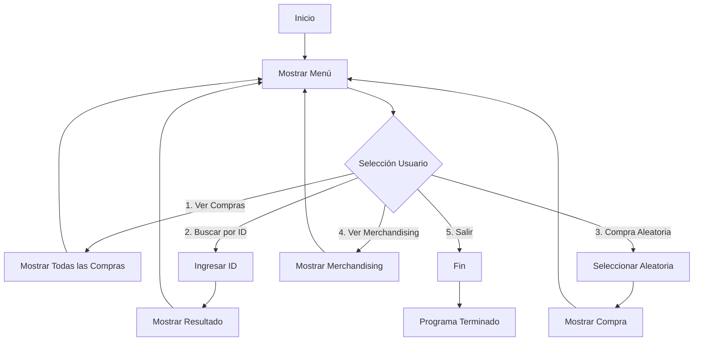

# Compraventa App

[](https://www.oracle.com/java/)
[](https://maven.apache.org/)
[](https://junit.org/junit5/)

Una aplicación Java profesional para la gestión de un sistema de compraventa de productos, especializada en videojuegos y merchandising. Implementa un patrón DAO para el acceso a datos y utiliza programación orientada a objetos con herencia y polimorfismo.

## 📋 Tabla de Contenidos
- [Descripción](#descripción)
- [Funcionalidades](#funcionalidades)
- [Arquitectura](#arquitectura)
- [Tecnologías](#tecnologías)
- [Instalación](#instalación)
- [Uso](#uso)
- [Estructura del Proyecto](#estructura-del-proyecto)
- [Pruebas](#pruebas)
- [Contribución](#contribución)
- [Licencia](#licencia)

## 📖 Descripción

La aplicación Compraventa es un sistema de gestión de compras desarrollado en Java que permite a los usuarios interactuar con un catálogo de productos a través de una interfaz de consola. El sistema está diseñado siguiendo principios de arquitectura limpia, separando la lógica de negocio (modelo), el acceso a datos (DAO) y la presentación (consola).

### 🎯 Objetivos
- Demostrar el uso de POO avanzada en Java
- Implementar un patrón DAO para persistencia de datos
- Gestionar relaciones complejas entre entidades
- Proporcionar una interfaz de usuario intuitiva

## ✨ Funcionalidades

- **📋 Visualización de Compras**: Ver todas las compras realizadas en el sistema
- **🔍 Búsqueda por ID**: Buscar compras específicas utilizando su identificador único
- **🎲 Compra Aleatoria**: Mostrar una compra seleccionada aleatoriamente
- **🛍️ Información de Merchandising**: Visualizar detalles de productos de merchandising
- **🚪 Salida Segura**: Opción para salir de la aplicación de manera controlada

## 🏗️ Arquitectura

### Diagrama de Clases



### Flujo de la Aplicación



### Patrón Arquitectónico
- **MVC Simplificado**: Separación entre modelo (entidades), vista (consola) y controlador (DAO)
- **DAO Pattern**: Abstracción del acceso a datos
- **Herencia**: Producto como clase base para Videojuego y Merchandising

## 🛠️ Tecnologías

- **Lenguaje**: Java 17
- **Gestión de Dependencias**: Apache Maven 3.8+
- **Testing**: JUnit 5
- **Documentación**: Javadoc
- **Control de Versiones**: Git
- **IDE Recomendado**: Visual Studio Code / IntelliJ IDEA

## 📦 Instalación

### Prerrequisitos
- JDK 17 o superior instalado
- Maven 3.8+ configurado
- Git (opcional, para clonar el repositorio)

### Pasos de Instalación

1. **Clonar el repositorio** (si aplica):
   ```bash
   git clone <url-del-repositorio>
   cd compraventaapp
   ```

2. **Compilar el proyecto**:
   ```bash
   mvn clean compile
   ```

3. **Ejecutar las pruebas** (opcional, para verificar):
   ```bash
   mvn test
   ```

## 🚀 Uso

### Ejecución de la Aplicación

```bash
java -cp target/classes org.palomafp.compraventa.App
```

### Interfaz de Usuario

Al ejecutar la aplicación, se presenta un menú interactivo:

```
=== MENÚ COMpraventa ===
1. Ver todas las compras
2. Buscar compra por ID
3. Mostrar compra aleatoria
4. Ver información de merchandising
5. Salir
Seleccione una opción:
```

### Ejemplos de Uso

- **Ver todas las compras**: Seleccionar opción 1 muestra una lista completa de todas las transacciones
- **Buscar por ID**: Ingresar un ID numérico para ver detalles específicos de una compra
- **Compra aleatoria**: Genera y muestra una compra seleccionada aleatoriamente del sistema

## 📁 Estructura del Proyecto

```
compraventaapp/
├── pom.xml                          # Configuración Maven
├── doc/
│   ├── README.md                    # Documentación del proyecto
│   └── diagrama_clases.md           # Diagramas adicionales
├── src/
│   ├── main/
│   │   └── java/
│   │       └── org/palomafp/compraventa/
│   │           ├── App.java         # Clase principal con menú
│   │           ├── ComprasDAO.java  # DAO para gestión de compras
│   │           └── modelo/
│   │               ├── Compra.java
│   │               ├── HistorialPrecios.java
│   │               ├── Merchandising.java
│   │               ├── Producto.java
│   │               ├── Tienda.java
│   │               ├── Usuario.java
│   │               └── Videojuego.java
│   └── test/
│       └── java/
│           └── org/palomafp/compraventa/
│               ├── AppTest.java
│               └── CompraVentaDAOTest.java
└── target/                          # Archivos compilados (generado)
```

### Descripción de Paquetes

- **`org.palomafp.compraventa`**: Paquete principal
  - `App.java`: Punto de entrada de la aplicación
  - `ComprasDAO.java`: Lógica de acceso a datos
- **`org.palomafp.compraventa.modelo`**: Entidades del dominio
  - `Producto.java`: Clase base para productos
  - `Videojuego.java` & `Merchandising.java`: Especializaciones de producto
  - `Compra.java`: Representa transacciones
  - `Usuario.java`: Información de usuarios
  - `Tienda.java`: Datos de tiendas
  - `HistorialPrecios.java`: Histórico de precios

## 🧪 Pruebas

El proyecto incluye una suite completa de pruebas unitarias usando JUnit 5.

### Ejecución de Pruebas

```bash
mvn test
```

### Cobertura de Pruebas

- **AppTest**: Pruebas básicas de la aplicación
- **CompraVentaDAOTest**: Pruebas del DAO
  - `testGetAllCompras()`: Verifica que la lista de compras no esté vacía
  - `testGetRandomCompra()`: Valida obtención de compra aleatoria
  - `testGetByidCompraTrue()`: Prueba búsqueda exitosa por ID
  - `testGetByidCompraFalse()`: Prueba búsqueda fallida por ID

### Generación de Reportes

```bash
mvn surefire-report:report
```

Los reportes se generan en `target/site/surefire-report.html`.

## 🤝 Contribución

1. Fork el proyecto
2. Crea una rama para tu feature (`git checkout -b feature/AmazingFeature`)
3. Commit tus cambios (`git commit -m 'Add some AmazingFeature'`)
4. Push a la rama (`git push origin feature/AmazingFeature`)
5. Abre un Pull Request

### Guías de Contribución
- Seguir las convenciones de código Java
- Añadir pruebas para nuevas funcionalidades
- Actualizar documentación según cambios
- Usar commits descriptivos

## 📄 Licencia

Este proyecto está bajo la Licencia MIT. Ver el archivo `LICENSE` para más detalles.

---

**Desarrollado por**: Miguel Sanguña y Alejadnro Aranda
**Versión**: 1.0.0  
**Última actualización**: Marzo 2026