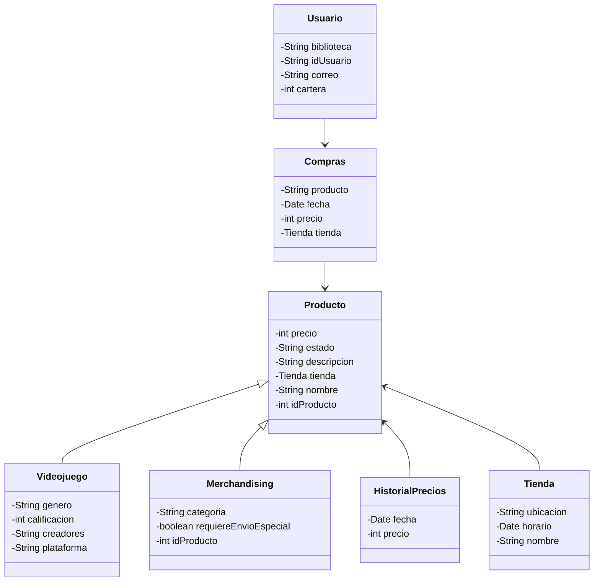

```mermaid
classDiagram

Producto <|-- Videojuego
Producto <|-- Merchandising
Producto <-- HistorialPrecios
Producto <-- Tienda
Usuario --> Compras
Compras --> Producto

class Producto {
    -int precio
    -String estado
    -String descripcion
    -Tienda tienda
    -String nombre
    -int idProducto

}

class Videojuego {
    -String genero
    -int calificacion
    -String creadores
    -String plataforma

}

class HistorialPrecios {
    -Date fecha
    -int precio

}

class Merchandising {
    -String categoria
    -boolean requiereEnvioEspecial
    -int idProducto

}

class Tienda {
    -String ubicacion
    -Date horario
    -String nombre

}

class Usuario {
    -String biblioteca
    -String idUsuario
    -String correo
    -int cartera

}

class Compras {
    -String producto
    -Date fecha
    -int precio
    -Tienda tienda

}


```
